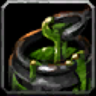
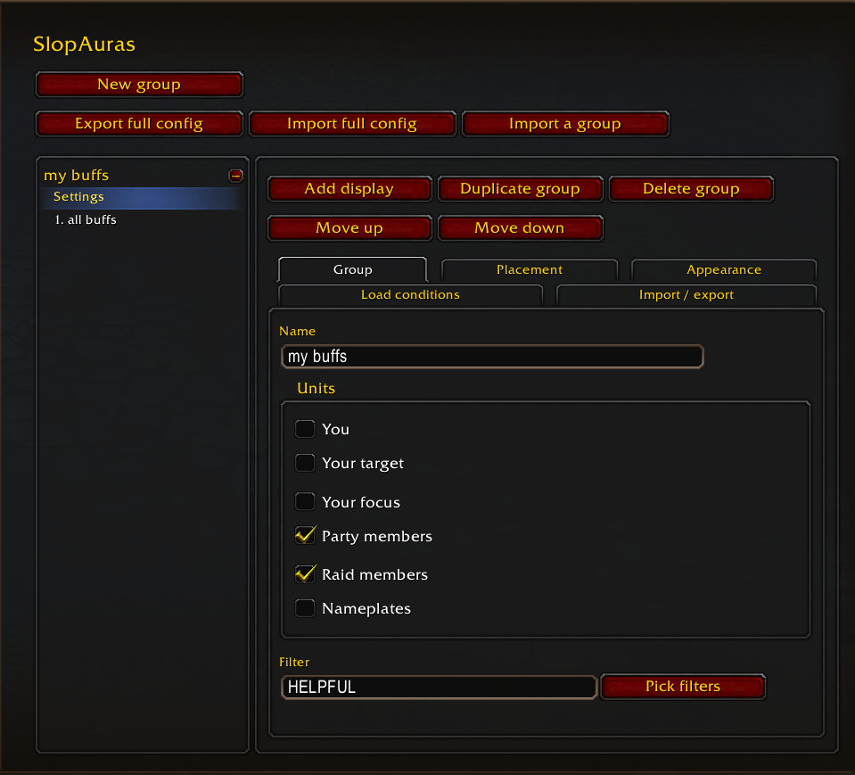
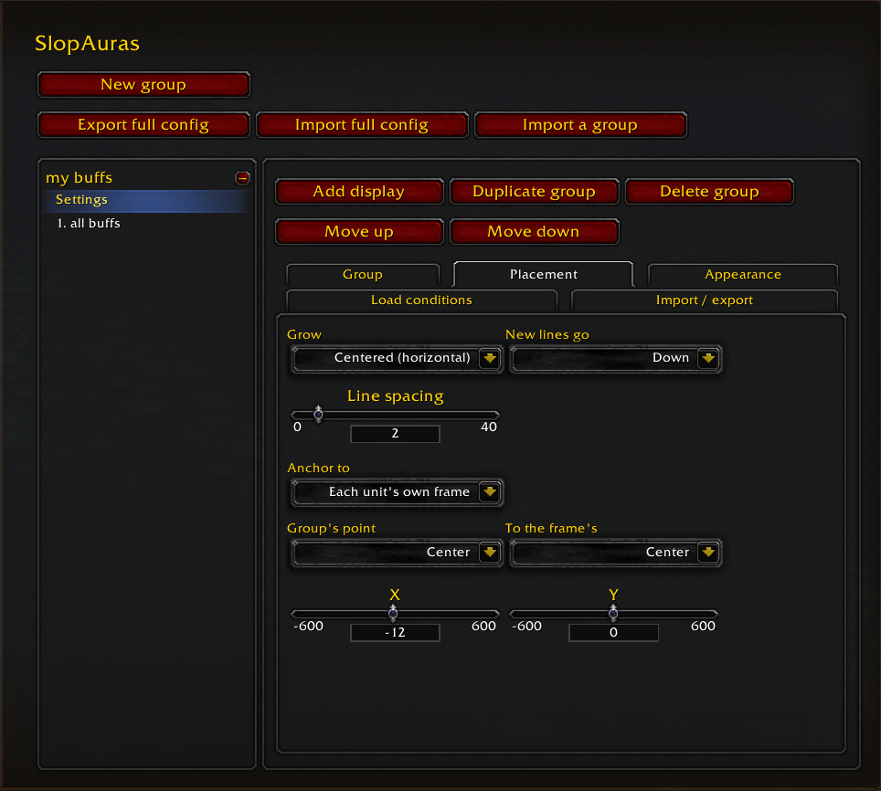
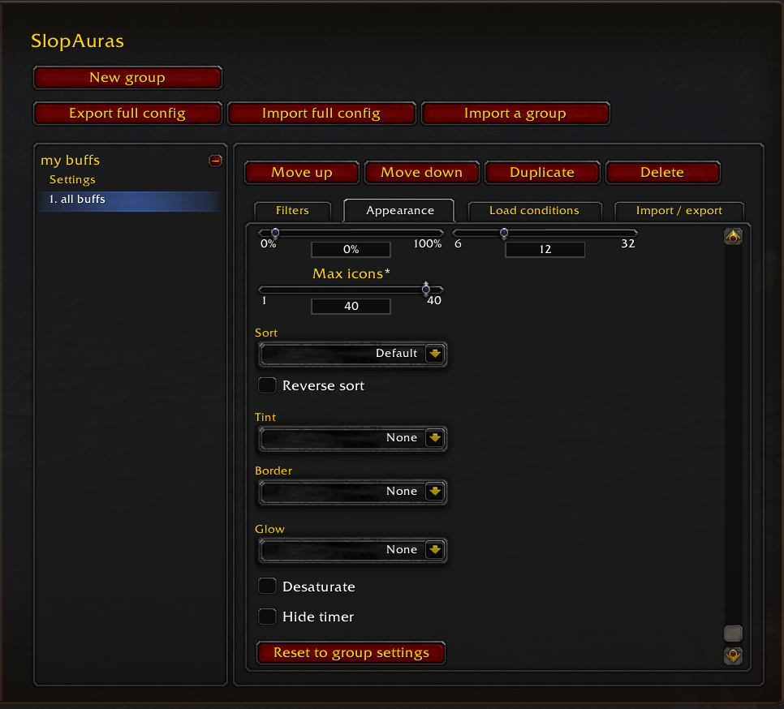
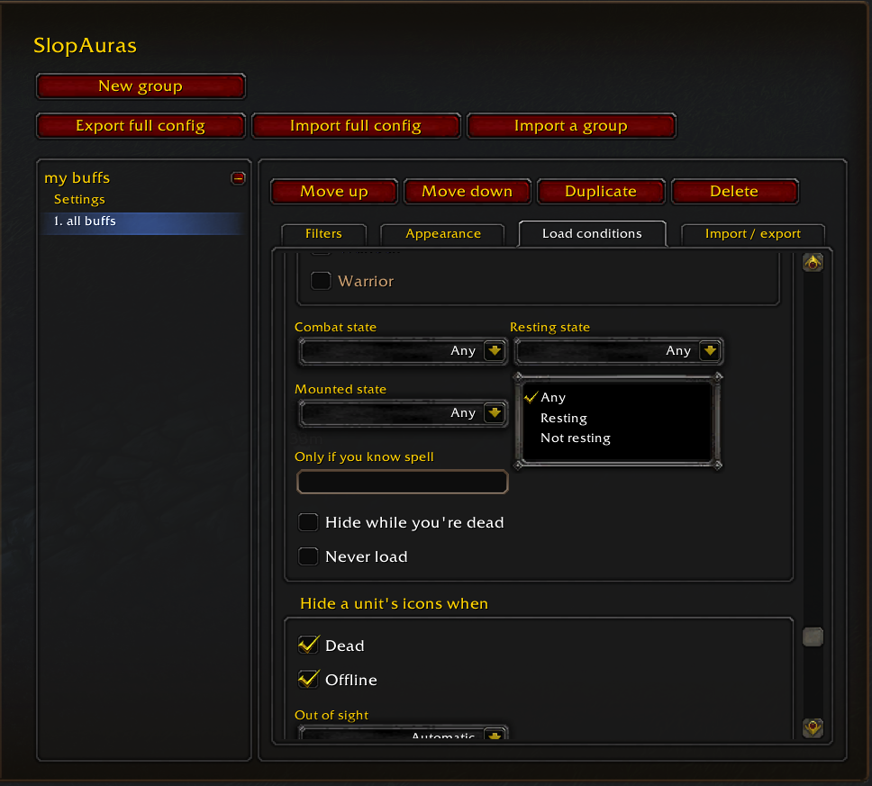

#  SlopAuras

<table>
  <tr>
    <td><a href="screenshots/group.png"></a></td>
    <td><a href="screenshots/placement.png"></a></td>
  </tr>
  <tr>
    <td><a href="screenshots/display-appearance.png"></a></td>
    <td><a href="screenshots/load-conditions.png"></a></td>
  </tr>
</table>

[Available on CurseForge.](https://www.curseforge.com/wow/addons/slopauras)

SlopAuras is a close-to-the-metal frontend for AuraContainers. It manages frame creation and anchoring so you can focus on building the bits you care about.

Some familiarity with AuraFilters and a novice understanding of AuraContainers is assumed. If that doesn't make any sense to you, please expect a bit of a learning curve. That said, SlopAuras ships with an `AGENTS.md` file that should help your favorite robot understand its settings and the game's rules. Give it your `SlopAuras` folder and describe what you want to see. You should be able to get a tailored walkthrough or a ready-made import string.

## Features

Most of the ways you'd wanna manipulate auras are covered. Includes helpers for stuff like multiple ranks of spells and icons for missing auras (where the game lets you).

Visibility filtering is pretty good: class, combat state, spells you do or don't know, lots of other stuff.

Appearance settings are somewhat limited but hopefully cover most of what you're used to. Desaturation, tints, glows and that kinda stuff is all there.

Displays can be anchored automatically to pretty much any unit frame-- raid frames, party frames, nameplates, etc. For now assumes you're using default unit frames, but support for at minimum Grid2 is likely in the future.

`/slop` opens settings and you should be good to go. Import/export is everywhere you'd need, full configs to specific displays.

## Performance

I did not write a single line of this code. 100% of this software has been generated by Claude. I had a very specific vision of what I needed out of an AuraContainer manager and this is a faithful encoding of that idea. It is unlikely it has been written very performantly. No human has ever read it. If you are a human who is good at that sort of thing, and you want to make a better version of SlopAuras, please steal from this project anything you need.

## Examples

All of these examples are real things I needed and in all cases an LLM was able to generate them as import strings.

### Party CC

A large icon anchored to your party frames that shows the longest crowd control on each party member

```
SlopAuras:1:group:{"name":"party cc","target":["party"],"anchorTo":"unit","anchor":{"point":"BOTTOMLEFT","relativePoint":"BOTTOMRIGHT","x":4,"y":0},"growth":"RIGHT","displays":[{"name":"longest cc","filter":"HARMFUL|CROWD_CONTROL","max":1,"size":36,"sort":"ExpirationOnly","sortReverse":true,"dispelBorder":true}]}
```

### Stuff you can dispel

Icons for any debuffs you can dispel off a party or raid member

```
SlopAuras:1:group:{"name":"dispellable","target":["party","raid"],"anchorTo":"unit","anchor":{"point":"BOTTOMLEFT","relativePoint":"BOTTOMLEFT","x":3,"y":11},"growth":"RIGHT","displays":[{"name":"you can dispel","filter":"HARMFUL|RAID","max":3,"size":14,"dispelBorder":true}]}
```

### Dispellable buffs on nameplates

Show all dispellable magic buffs on enemy nameplates, while on a character that knows dispel magic or purge

```
SlopAuras:1:group:{"name":"purgeable buffs","target":["nameplate"],"anchorTo":"unit","anchor":{"point":"BOTTOM","relativePoint":"TOP","x":0,"y":-8},"growth":"CENTER","knownSpell":[527,370],"displays":[{"name":"magic buffs","filter":"HELPFUL|DISPELLABLE","dispelTypes":["Magic"],"max":6,"size":18,"dispelBorder":true}]}
```

## Credits

- Spell rank data from [talentsforever.com](https://talentsforever.com), used under [CC BY 4.0](https://creativecommons.org/licenses/by/4.0/).
- Settings UI built on [Ace3](https://github.com/WoWUIDev/Ace3).
- Fonts from [LibSharedMedia-3.0](https://www.curseforge.com/wow/addons/libsharedmedia-3-0), used under the LGPL v2.1.
- Bipp Glizzitor (Beta Tester)
